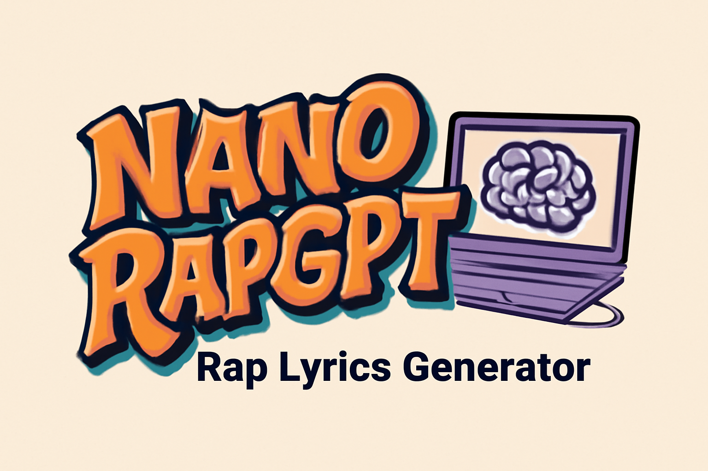

# NanoRapGPT (Fine-Tuned GPT-2)



This repository contains a fine-tuned version of the original minGPT project. Using a custom dataset of rap lyrics, I fine-tuned a GPT-2 model to transform it into a rap lyrics generator. The code is simple and modular: `train.py` implements a ~300-line training loop, and `model.py` defines the GPT model in ~300 lines, with optional support for loading pre-trained GPT-2 weights from OpenAI. The model is still under development but already generates creative and unique rap lyrics. Training is performed on a single NVIDIA 3090 24GB GPU and takes less than 10 minutes to fine-tune. This project is under active development!

The simplicity of the code makes it easy to customize, train new models from scratch, or fine-tune pre-trained checkpoints (e.g., the GPT-2 1.3B model from OpenAI).

## Disclaimer on Sensitive Content

This project uses a dataset of rap lyrics, which may contain sensitive or explicit language. Consequently, the generated lyrics might also include such content. Sensitive words have not been filtered out, as they are integral to the rap genre, particularly in the context of American rap culture. Please use this project responsibly and be mindful of the potential for sensitive content in the outputs.

## Updates
- Since the GPT-2 tokenizer lacks a padding token, a rare token (`token_id=29, >`) is used as a substitute. An attention mask (`attn_mask`) is applied to handle variable-length text during the attention mechanism.

## Installation

Install the required dependencies:

```sh
pip install torch numpy transformers datasets tiktoken wandb tqdm lyricsgenius
```

Dependencies:
- [PyTorch](https://pytorch.org) <3
- [NumPy](https://numpy.org/install/) <3
- `transformers` for Hugging Face Transformers <3 (to load GPT-2 checkpoints)
- `datasets` for Hugging Face Datasets <3 (for downloading and preprocessing OpenWebText)
- `tiktoken` for OpenAI's fast BPE tokenizer <3
- `wandb` for optional logging <3
- `tqdm` for progress bars <3

## Lyrics Data Generation

### Option 1: Load Dataset from Hugging Face
The processed dataset is available on Hugging Face and can be loaded directly:

```python
dataset = load_dataset('JunhaoYu/processed_rap_lyrics', split="train")
```

To generate compatible `train.bin` and `val.bin` files, run the `data/lyrics/prepare.py` script:

```sh
python data/lyrics/prepare.py
```

### Option 2: Use a Custom Dataset
> Tested only on Windows; compatibility with Linux is not guaranteed.

Follow these steps to generate lyrics data:

#### Step 1: Crawl Lyrics Data
Use the `crawl.py` script to fetch lyrics data from the Genius API. Specify target artists via a file or command-line arguments:

```sh
python data/lyrics/data_generator/crawl.py --user_token=<your_genius_api_token> \
                                           --data_dir=<output_directory> \
                                           --max_songs=<max_songs_per_artist> \
                                           --artist_file=<path_to_artist_file> \
                                           --artists <artist1> <artist2> ...
```

**Key Parameters:**
- `--user_token`: Your Genius API user token (required).
- `--data_dir`: Directory to save the crawled data (default: `json`).
- `--max_songs`: Maximum number of songs to fetch per artist (default: `40`).
- `--artist_file`: Path to a file containing artist names (one per line).
- `--artists`: List of artist names provided directly via the command line.

#### Step 2: Preprocess Lyrics Data
Run the `preprocess.py` script to clean and process the crawled lyrics data. The processed data will be saved as a single JSON file:

```sh
python data/lyrics/data_generator/preprocess.py --data_dir=<input_directory> \
                                                --save_dir=<output_directory>
```

**Key Parameters:**
- `--data_dir`: Directory containing the crawled data (default: `json`).
- `--save_dir`: Directory to save the processed `data.json` file.

#### Step 3: Prepare Binary Files
Convert the processed `data.json` file into binary files (`train.bin` and `val.bin`) for training:

```sh
python data/lyrics/prepare.py
```

This script:
1. Loads the `data.json` file.
2. Splits the dataset into training and validation sets.
3. Tokenizes the lyrics using the GPT-2 tokenizer.
4. Saves the tokenized data as binary files (`train.bin` and `val.bin`).

## Fine-Tuning

Fine-tuning is similar to training but initializes from a pre-trained model and uses a smaller learning rate. To fine-tune the model, run:

```sh
python train.py config/finetune_lyrics.py --start="FILE:demo.txt"
```

This command uses the configuration in `config/finetune_lyrics.py`. The best checkpoint (lowest validation loss) will be saved in the `out_dir` directory (default: `out-lyrics`). You can then sample from the model using:

```sh
python sample.py --out_dir=out-lyrics
```

Example input (`demo.txt`):
```
[Intro]  
I'm back with the heat, let the rap begin,  
Now we break it down, watch the magic spin,  
AI spitting bars, you know it's a win.  
```

Example output:
```
[Intro]  
I'm back with the heat, let the rap begin,  
Now we break it down, watch the magic spin,  
AI spitting bars, you know it's a win.  
They say I'm an emcee so I'm thinking I should give them an apology,  
When on the mic they will not even make eye contact but they can tell I'm tough,  
I'm going to give it right back to them because they gave them the wrong
Doomed up in the gang, so you play them good and they still lose.
They call me the king of their shit, shit like that ain't fun,
I told you, kids, I'm the king, and I really mean it.
```

## Sampling / Inference

Use `sample.py` to generate text from pre-trained GPT-2 models or your fine-tuned model. For example:

```sh
python sample.py \
    --init_from=gpt2-xl \
    --start="What is the answer to life, the universe, and everything?" \
    --num_samples=5 --max_new_tokens=100
```

To sample from your fine-tuned model, specify the `--out_dir` parameter.

## Efficiency Notes

For benchmarking and profiling, use `bench.py`. It replicates the core training loop of `train.py` but omits additional complexities.

The code uses [PyTorch 2.0](https://pytorch.org/get-started/pytorch-2.0/), which supports `torch.compile()` for performance optimization. This can significantly reduce iteration time (e.g., from ~250ms to 135ms per iteration).

## Troubleshooting

If you encounter issues with PyTorch 2.0, disable `torch.compile()` by adding the `--compile=False` flag. This will slow down the code but ensure compatibility.

For additional context, check out the [Zero To Hero series](https://karpathy.ai/zero-to-hero.html), particularly the [GPT video](https://www.youtube.com/watch?v=kCc8FmEb1nY).

For discussions, join the **#nanoGPT** channel on Discord:

[](https://discord.gg/3zy8kqD9Cp)
